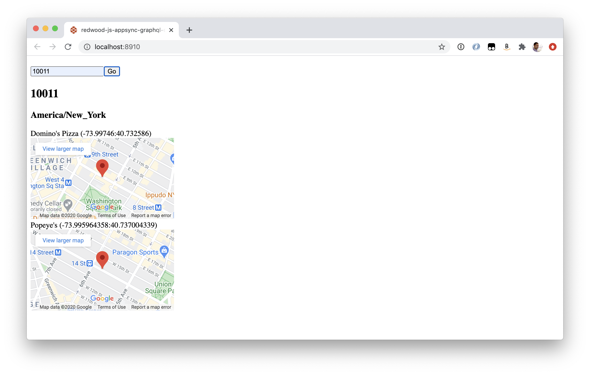

A [Redwood.js](https://redwoodjs.com) demo app that retrieves and displays data from an AppSync GraphQL service. See [this discussion](https://community.redwoodjs.com/t/how-can-i-wire-up-a-graphql-api-to-redwoodjs/1112) for details.



### Run Me

#### API

I used an AppSync endpoint that returned data with the following schema. This was an existing service that is not available publicly.

```graphql
type ZipData {
	zip: String
	timezone: String
	restaurants: [RestaurantData]
}

type RestaurantData {
	name: String
	latitude: String
	longitude: String
}

type Query {
	get_zip(zip: String!): ZipData
}

schema {
	query: Query
}
```

#### Settings

Create `.env` with the following settings

```
GOOGLE_MAPS_API_KEY=
APPSYNC_API_ENDPOINT_URL=https://....appsync-api.us-east-1.amazonaws.com/graphql
APPSYNC_API_KEY=
```

#### Run

```
yarn redwood dev
```


